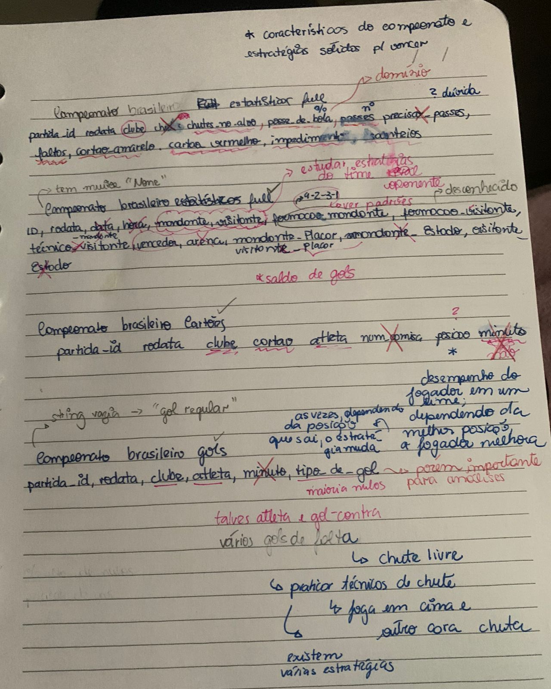

# Documentação extra

Nesse arquivo irei pontuar algumas decisões que foram importantes para a resolução do desafio.

## Reunião com conhecido situado no assunto

Realizei uma breve reunião com um conhecido que possui conhecimento aprofundado sobre o contexto do desafio, especialmente em relação a campeonatos de futebol. Durante esse encontro, discutimos quais informações seriam mais relevantes para análise e quais insights poderiam ser extraídos da base de dados. A partir dessa discussão, eu mesma analisei as bases de dados sozinha e de forma manual para extrair as colunas que seriam relevantes para minhas ideias iniciais de consultas e análises sobre essas bases.

Esse momento foi essencial para me familiarizar melhor com o tema, entender os indicadores mais importantes e, assim, realizar análises mais direcionadas e com maior embasamento teórico. A troca de ideias enriqueceu minha interpretação dos dados e contribuiu para uma abordagem mais crítica e estratégica.

**Imagem das anotações feitas durante a reunião:**

## Declaração do uso de IA

Utilizei ferramentas de Inteligência Artificial para me auxiliar na revisão e melhoria de textos, bem como para validar algumas abordagens analíticas. A IA foi usada como apoio na estruturação de visualizações e organização da narrativa técnica.

## Bibliografia

GE GLOBO. Campeonato Brasileiro Série A – Tabela e Resultados. Disponível em: <https://ge.globo.com/futebol/brasileirao-serie-a/>. Acesso em: 21 jun. 2025.

DUQUE, Adão. *Brasileirão Dataset*. GitHub, 2024. Disponível em: <https://github.com/adaoduque/Brasileirao_Dataset/>. Acesso em: 21 jun. 2025.
